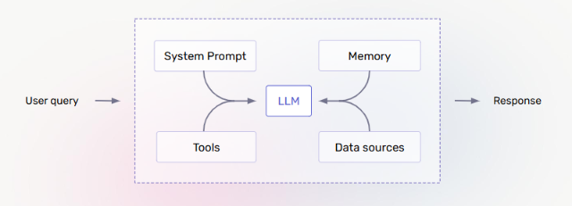
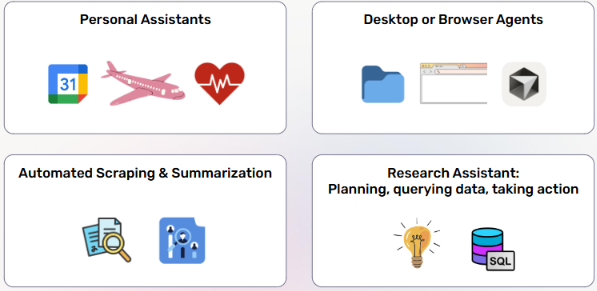
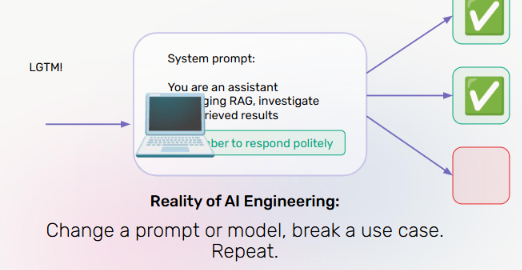

# Lecture 1: Introduction to Agents

## Course: Agent Mastery

---

## 1. Agents: LLM-Based Applications

An **agent** is an LLM-based application that goes beyond simple prompt-response — it combines several components together to reason, decide, and act.

The core anatomy of an agent looks like this:

**Components:**

| Component | Role |
|---|---|
| **System Prompt** | Defines the agent's identity, behavior, and constraints |
| **Memory** | Retains context across turns or sessions |
| **Tools** | External functions/APIs the agent can call to take action |
| **Data Sources** | External knowledge the agent can query (databases, documents, APIs) |
| **LLM** | The reasoning core that ties everything together and decides what to do |

**Flow:** A `User query` enters the system → the LLM reasons over the system prompt, memory, tools, and data sources → produces a `Response`.

This is the foundational blueprint you'll see repeated across almost every agent framework in this course.

---

## 2. What Could Go Wrong with Agent-Based Systems?

Unlike traditional software, agents are **non-deterministic** — the same input can produce different outputs depending on how the LLM reasons at that moment. This introduces new failure modes:

- Calling the **wrong tool** for a task
- **Misconstructing** a tool/API call (e.g., malformed search query)
- Retrieving or using **irrelevant context**
- Responding in the **wrong tone**, or being **jailbroken** into inappropriate behavior
- Producing a response that is technically "successful" per step, but **overall incorrect**

We'll revisit this in detail in Section 5 (Agent Evaluation).

---

## 3. Agent Use Cases

Agents are already being applied across a wide range of real-world domains:

| Use Case | Examples |
|---|---|
| **Personal Assistants** | Calendar management, travel booking, health tracking |
| **Desktop or Browser Agents** | File system navigation, browser automation, 3D/design tool control |
| **Automated Scraping & Summarization** | Document extraction, trend/report summarization |
| **Research Assistant** | Planning a research approach, querying structured data (e.g., SQL), taking follow-up actions |

**Key takeaway:** Agent use cases generally fall into two buckets — *information retrieval + synthesis* (research, scraping) and *action-taking on the user's behalf* (booking, file/browser control).

---

## 4. Popular Agent Frameworks

*(Framework-specific comparisons will be covered in depth in Lecture 3: Agent Frameworks and Architectures — this lecture focuses on core concepts before diving into tooling.)*

---

## 5. Anatomy of an Agent — Worked Example: Trip Planning

Let's ground the agent architecture from Section 1 in a concrete example.

**Prompt:** *"Book me a trip to San Francisco 🌁"*

To fulfill this request, the agent must go through a sequence of reasoning and action steps:

1. **Figure out which tool to call** — e.g., a flight/hotel booking tool vs. a search tool
2. **Search API** — actually invoke the correct API with the correct parameters
3. **Use context** — pull in relevant retrieved information (dates, preferences, prior conversation)
4. **Construct a response** — generate a reply that's accurate and appropriately toned
5. **Overall correctness** — did the end-to-end task actually get done correctly?

Each of these steps is a potential point of failure — and each one maps directly to a specific *type* of evaluation, covered next.

---

## 6. Agent Evaluation Example

Each step of the trip-planning task corresponds to a distinct evaluation category:

| Step | Eval Type |
|---|---|
| Figure out which tool to call | **Tool selection eval** |
| Search API | **Function calling eval** |
| Use context | **RAG eval** |
| Construct a response | **Tone eval** |
| Overall correctness | **Correctness eval** |

This mapping is important — it means agent evaluation isn't a single pass/fail check, but a **layered set of evals**, each targeting a different failure surface.

---

## 7. What Could Go Wrong? (Applied)

Now let's see how each eval type surfaces a real failure, using a slightly trickier prompt:

**Prompt:** *"Book me a trip to San Francisco... San Diego 🏖"* (an ambiguous/corrected request)

| Step | Eval Type | Failure Mode |
|---|---|---|
| Figure out which tool to call | Tool selection eval | ❌ Calls the **wrong tool** |
| Search API | Function calling eval | ❌ **Constructs the search incorrectly** |
| Use context | RAG eval | *(context not properly used)* |
| Construct a response | Tone eval | ❌ Could be **jailbroken**, or respond **inappropriately** |
| Overall correctness | Correctness eval | ❌ **Unhappy user** ☹️ |

This illustrates why evals need to be run **per component**, not just on the final output — a failure early in the chain (wrong tool) cascades into every step after it.

---

## 8. Even Small Changes Can Cause Performance Regressions

One of the most important — and most frustrating — realities of building agents:

> **Reality of AI Engineering:** Change a prompt or model, break a use case. Repeat.

Because agents rely on LLMs, small changes that seem harmless can silently break previously-working behavior:

- Editing a **system prompt** to fix one use case can regress another
- **Swapping models** (even to a "better" one) can change tool-calling behavior or tone
- A **fix for one eval** (e.g., correctness) can introduce a **new failure** in another (e.g., tone)

This is why **continuous, layered evaluation** (Section 6) isn't optional — it's the only way to catch regressions before they reach users.

---

## 9. Software Testing vs. Agent Evals

| | **Software Testing** | **Agent Evals** |
|---|---|---|
| **Determinism** | Software is deterministic | LLM agents are **non-deterministic** |
| **Unit-level checks** | Unit tests are deterministic — same input, same output, every time | Agents can take **multiple valid paths** to a similar output |
| **Foundation** | Integration tests rely on the existing codebase and documentation | Improving agents relies on **data** (eval sets, traces, feedback) |

**Key takeaway:** You can't test an agent the way you test traditional software. Instead of asserting exact outputs, you evaluate *distributions of behavior* against a labeled dataset — and you improve agents by iterating on data, not just code.

---

## 10. What You've Learned

By the end of this lecture, you should understand:

- ✅ How AI agents can be used to perform real-world tasks (Section 3)
- ✅ The similarities and differences between evaluating traditional software and evaluating AI agents (Section 9)

---

## 11. Hands-On: Set Up Your First Agent — Trip Advisor Agent

Now that you understand the anatomy and evaluation model of an agent, it's time to build one.

**Task:** Set up your **first agent** using the **Trip Advisor Agent** example provided in the course repository.

**Steps:**
1. Clone the course repository and locate the `Trip Advisor Agent` example.
2. Follow the repo's setup instructions (environment variables, API keys, and dependencies).
3. Run the agent locally and issue a sample query (e.g., *"Book me a trip to San Francisco"*).
4. Observe how the agent moves through the anatomy from Section 1 — system prompt → tool selection → API call → response.
5. Try a slightly ambiguous or multi-part query (like the San Francisco → San Diego example in Section 7) and see which step breaks.

> This hands-on exercise directly reinforces Sections 5–7: you'll see tool selection, function calling, and correctness evaluation happening in real time, not just on paper.

---

## 12. Test Your Understanding

Before moving to Lecture 2, check your understanding with these questions:

1. **What are the five core components in the anatomy of an agent, as shown in the architecture diagram?**
2. **In the trip-planning example, which evaluation type would catch an agent constructing an incorrect search query?**
3. **Why can't traditional software testing techniques (e.g., deterministic unit tests) be directly applied to agent evaluation?**
4. **If you change your system prompt to fix a tone issue and a previously-working tool-selection use case breaks, what does this illustrate about agent engineering?**
5. **Name two use case categories agents are commonly applied to today.**

*(Try answering these from memory before checking back against Sections 1, 6, 9, 8, and 3 respectively.)*

---

*Next: Lecture 2 — Agent Engineering*
