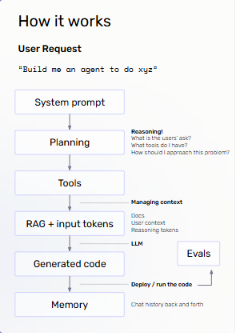
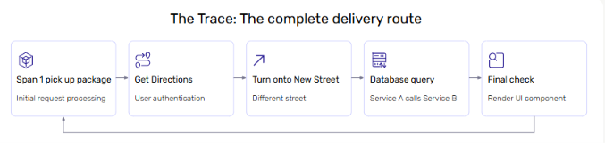
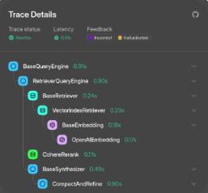

# Lecture 2: Agent Engineering

## Course: Agent Mastery

---

## 1. What Is Agent Engineering?

**Agent engineering** is the discipline of designing a system — not just a prompt — to accomplish a task reliably.

As an agent engineer, your job goes beyond writing code. You need to think through:

- **What is the ideal user experience** for this product?
- **How does an agent actually help here** — is an agent even the right solution?
- **What form should this agent take?**
  - What **context** does it need to do its job?
  - What **tools** does it need access to?
  - Should this agent run **in the foreground** (user-facing, interactive) or **in the background** (autonomous, triggered)?

**Key takeaway:** Agent engineering starts with product thinking, not architecture. The tools and context an agent needs _flow from_ the user experience you're designing for — not the other way around.

---

## 2. How an Agent Works, End-to-End

Once you've defined the product shape, the agent itself follows a repeatable internal flow:

| Stage                    | What Happens                                                                                           |
| ------------------------ | ------------------------------------------------------------------------------------------------------ |
| **User Request**         | The task enters the system (e.g., _"Build me an agent to do xyz"_)                                     |
| **System Prompt**        | Defines the agent's role and constraints                                                               |
| **Planning**             | The agent reasons: _What is the user's ask? What tools do I have? How should I approach this problem?_ |
| **Tools**                | The agent selects and prepares to call the tools it needs                                              |
| **RAG + Input Tokens**   | Context is assembled and managed — docs, user context, and reasoning tokens are combined               |
| **Generated Code / LLM** | The LLM produces the output — this is also where **Evals** plug in to check quality                    |
| **Memory**               | The interaction (chat history) is stored and carried forward                                           |

This loop — **plan → act → generate → remember** — is the backbone of almost every agent architecture, and it's the structure observability (next section) is designed to make visible.

---

## 3. What Is Agent Observability?

**Observability** is the ability to understand what is happening _inside_ an agent system, from the outside.

It turns an agent's opaque "black box" reasoning into something **visible, interpretable, and diagnosable**.

### Why It Matters

Observability is critical for:

- **Debugging agent behavior** — understanding _why_ an agent did what it did
- **Identifying bottlenecks** — e.g., slow tool calls or repeated reasoning loops
- **Tracking hallucinations and errors** — catching incorrect or fabricated outputs
- **Providing transparency for stakeholders** — giving non-engineers visibility into agent decisions

---

## 4. Observability — Why It Matters (Verifying Change)

Beyond debugging, observability's biggest value is that it lets you **change your system and verify those changes actually took effect.**

Common changes you'll want to verify:

- Changing **architecture** (e.g., serial agent → parallel agent)
- Changing your **prompt**
- Changing your **model**
- **Context engineering** (what information the agent has access to)

> **Coupled with evals**, observability lets you objectively confirm you're making your system _better_ — not just different.

This directly connects back to Lecture 1, Section 8: _"Change a prompt or model, break a use case."_ Observability is how you catch that regression before your users do.

---

## 5. Traces, Spans, and the Three Pillars

Observability relies on **three categories of signals**:

| Signal             | Description                                                   |
| ------------------ | ------------------------------------------------------------- |
| **Traces & Spans** | End-to-end request lifecycles, represented as attribute JSONs |
| **Metrics**        | Numerical measurements — e.g., latency, success rate          |
| **Logs**           | Detailed, event-level records                                 |

### Why Traces Matter Most for Agents

For agents specifically, **traces are the most important signal**, because they reveal _reasoning and decision-making_ — not just whether a request succeeded or failed.

Each trace is composed of **spans**, which represent individual steps within that request:

- **Prompt spans** — inputs and outputs of LLM calls
- **Tool spans** — external API or function calls
- **Decision spans** — reasoning or planning steps

### Visualizing a Trace: The Delivery Route Analogy

A useful mental model: think of a trace as a **complete delivery route**, where each span is one leg of the journey.

| Span                    | Analogy                    | Represents                                   |
| ----------------------- | -------------------------- | -------------------------------------------- |
| Span 1: Pick up package | Initial request processing | The request enters the system                |
| Get Directions          | User authentication        | Identity/context is established              |
| Turn onto New Street    | A different step           | The agent takes an action or branch          |
| Database query          | Service A calls Service B  | Inter-service communication                  |
| Final check             | Render UI component        | The final response is assembled and returned |

---

## 6. Example Trace Tree

In practice, a trace is visualized as a **tree of spans**, showing exactly how an agent combined reasoning and tool calls to produce its final answer.

**Reading this trace:**

- The **top-level span** (`BaseQueryEngine`, 0.91s) represents the overall request
- It calls a `RetrieverQueryEngine` (0.80s), which in turn calls a `BaseRetriever` (0.24s)
- The retriever calls a `VectorIndexRetriever` → `BaseEmbedding` → `OpenAIEmbedding` (0.17s) to fetch relevant context
- A sibling span, `CohereRerank` (0.17s), reorders retrieved results
- Finally, `BaseSynthesizer` → `CompactAndRefine` (0.48s) generates the final answer
- Each span carries **latency** and can carry **feedback tags** (e.g., "Incorrect," "Hallucinated") for debugging

This is exactly the kind of visibility that turns "the agent gave a weird answer" into "the embedding retrieval step pulled irrelevant context, which propagated downstream."

---

## 7. Standards: OTel, OpenInference, and Auto-Instrumentors

To make traces usable across different tools and teams, the industry relies on shared standards:

| Standard                 | Purpose                                                                                                                                                                                                                          |
| ------------------------ | -------------------------------------------------------------------------------------------------------------------------------------------------------------------------------------------------------------------------------- |
| **OpenTelemetry (OTel)** | The general standard for collecting traces, metrics, and logs. Provides a common language across systems, ensuring consistency when agents call APIs, databases, or services.                                                    |
| **OpenInference (OI)**   | Extends OTel specifically for **LLM and ML systems**. Adds span types like prompts, tools, and evaluations — bringing richer semantics to capture agent _reasoning_, not just API calls.                                         |
| **Auto-instrumentors**   | Pre-built connectors under OpenInference that automatically capture spans for popular frameworks (e.g., **LangChain, AutoGen, LlamaIndex**). They give you observability with minimal setup, while still allowing customization. |

**Key takeaway:** You rarely need to build tracing from scratch — OTel gives you the foundation, OpenInference adapts it for LLM-specific reasoning, and auto-instrumentors plug it into the framework you're already using.

---

## 8. Test Your Understanding

Before moving to Lecture 3, check your understanding with these questions:

1. **Before choosing an agent's tools or context, what two product-level questions should you answer first?**
2. **In the "How it works" flow, at which stage does Planning happen, and what three questions does the agent reason through there?**
3. **Why are traces considered the most important observability signal for agents specifically (as opposed to metrics or logs alone)?**
4. **What are the three types of spans that make up a trace, and what does each one capture?**
5. **What is the relationship between OpenTelemetry (OTel) and OpenInference (OI)?**
6. **If you change your agent's architecture from serial to parallel, how would observability + evals together help you confirm the change was actually an improvement?**

_(Try answering these from memory before checking back against Sections 1, 2, 5, 5, 7, and 4 respectively.)_
