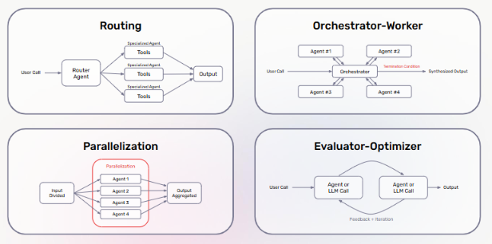
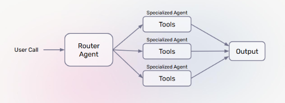
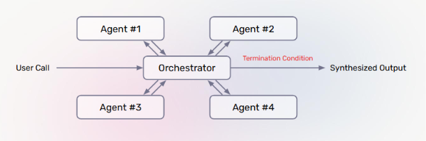
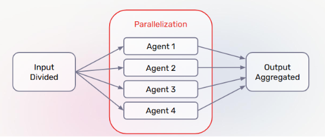
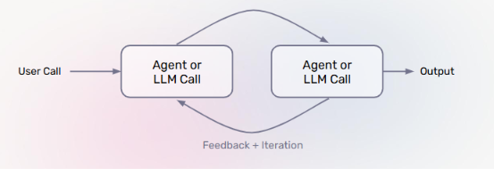

# Lecture 3: Agent Architecture

## Course: Agent Mastery

---

## 1. What Are Agent Architectures?

**Agent architectures** are foundational design patterns that shape *how* an AI agent handles three core dimensions of its behavior:

| Dimension | What It Governs |
|---|---|
| **Reasoning** | How the agent plans and makes decisions |
| **Action** | How the agent uses tools, APIs, and its environment |
| **Interaction** | How the agent manages conversations, memory, and feedback |

**Key takeaway:** An architecture isn't just a diagram — it's a decision about *how control flows* between the user, the LLM(s), and any tools involved. Picking the right architecture is what separates a fragile single-prompt agent from a system that scales to complex, multi-step tasks.

---

## 2. Common Agent Architectures — Overview

There are four foundational patterns you'll encounter repeatedly when designing agent systems:

| Pattern | Core Idea |
|---|---|
| **Routing** | A router classifies the task and sends it to the right specialist |
| **Orchestrator-Worker** | A central orchestrator splits work across multiple worker agents |
| **Parallelization** | Independent subtasks run simultaneously, then get aggregated |
| **Evaluator-Optimizer** | One agent generates, another critiques, and they loop until approved |

Let's go through each pattern in detail.

---

## 3. Pattern 1: Routing

**Routing** is used when a single system needs to handle *many different kinds* of requests, each best served by a different specialist.

**How it works:**

1. **Router agent classifies the task** — it inspects the incoming request and determines its category/intent.
2. **Input is routed to a specialized agent** — a domain-specific agent (with its own tools and prompt) handles the request.
3. **Specialized prompts and tools improve performance** — because each specialized agent is narrowly scoped, it performs better than one generalist agent trying to do everything.

**When to use it:** When your system faces a **wide variety of distinct task types** (e.g., billing questions vs. technical support vs. account changes) and a one-size-fits-all prompt would be too generic to handle all of them well.

---

## 4. Pattern 2: Orchestrator-Worker

**Orchestrator-Worker** is used for complex tasks that need to be **broken down and distributed** across multiple agents, then recombined.

**How it works:**

1. **Orchestrator agent splits tasks** — it decomposes a complex request into smaller sub-tasks.
2. **Tasks are dynamically assigned to worker agents** — unlike routing (fixed categories), assignment here can be dynamic and adjusted based on the task at hand.
3. **Results from worker agents are synthesized** — the orchestrator collects worker outputs and combines them into one coherent, synthesized output, governed by a **termination condition** (a rule for when enough work has been done).

**When to use it:** When a task is too large or multi-faceted for a single agent, but the sub-tasks still need to be **coordinated** and **combined** by a central authority — as opposed to running fully independently (see Parallelization, next).

---

## 5. Pattern 3: Parallelization

**Parallelization** is used when a task can be cleanly split into **independent** pieces that don't depend on each other's outputs.

**How it works:**

1. **Input is divided into independent subtasks** — the task is split up front, with no dependencies between the pieces.
2. **Each agent or LLM completes its assigned subtask** — all agents work simultaneously, not sequentially.
3. **Results are aggregated together to form the final output** — outputs are combined once all subtasks complete.

**When to use it:** When subtasks are **genuinely independent** (e.g., summarizing 4 separate documents, or generating 4 candidate answers to vote on). This is the key difference from Orchestrator-Worker: there's no central coordinator managing *dependencies* between agents — just a divide-and-aggregate flow, which makes it faster via true parallel execution.

---

## 6. Pattern 4: Evaluator-Optimizer

**Evaluator-Optimizer** is used when **response quality matters more than speed**, and iterative refinement is worth the extra latency/cost.

**How it works:**

1. **An LLM or agent generates a response** — a first-pass attempt at the task.
2. **Another LLM evaluates the response and provides feedback** — this second agent acts as a critic, checking the response against some standard (correctness, tone, completeness, etc.).
3. **The loop continues until the evaluator "approves" the response** — the generator revises based on feedback, and the cycle repeats until quality criteria are met.

**When to use it:** When output quality is critical and can be meaningfully judged (e.g., code generation with test validation, writing that needs to meet a style/tone bar). This pattern trades **extra latency and cost** for **higher reliability** in the final output.

---

## 7. Choosing Between Architectures

A quick way to decide which pattern fits your problem:

| If your task involves... | Consider... |
|---|---|
| Many distinct types of requests needing different handling | **Routing** |
| A complex task that needs to be broken down and coordinated | **Orchestrator-Worker** |
| Independent subtasks with no cross-dependencies | **Parallelization** |
| High-stakes output where quality needs iterative checking | **Evaluator-Optimizer** |

**Note:** These patterns aren't mutually exclusive — real-world agent systems often **combine** them (e.g., a router that sends a task to an orchestrator, whose workers each use an evaluator-optimizer loop internally).

---

## 8. Test Your Understanding

Before moving to Lecture 4, check your understanding with these questions:

1. **What are the three dimensions of agent behavior that an architecture shapes?**
2. **In the Routing pattern, why do specialized agents typically outperform a single generalist agent?**
3. **What is the key structural difference between Orchestrator-Worker and Parallelization, given that both involve multiple agents working on parts of a task?**
4. **What governs when an Orchestrator-Worker system stops collecting results and synthesizes its final output?**
5. **In the Evaluator-Optimizer pattern, what is being traded off in exchange for higher output quality?**
6. **If you were building a customer support agent that needs to (a) classify incoming tickets and (b) draft replies that get quality-checked before sending, which two patterns would you likely combine?**

*(Try answering these from memory before checking back against Sections 1, 3, 4–5, 4, 6, and 7 respectively.)*

---

*Next: Lecture 4 — Tools and MCP*
