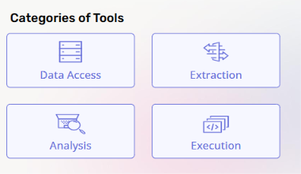
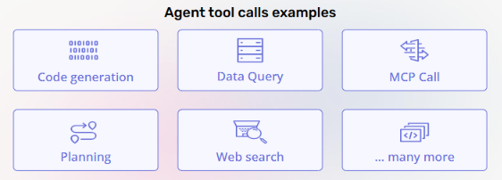
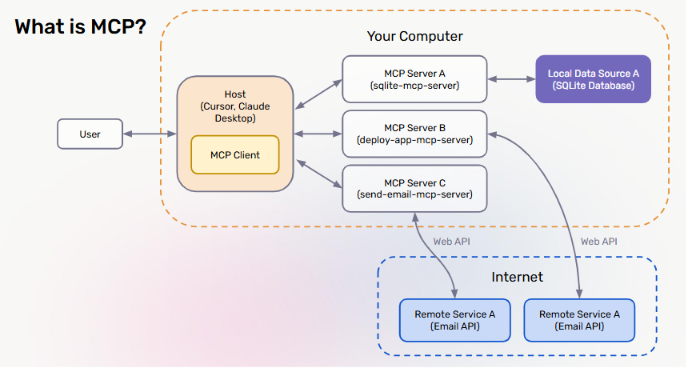

# Lecture 4: Tools and MCP

## Course: Agent Mastery

---

## 1. What Are AI Agent Tools?

**Tools** are external capabilities that an agent can call to extend its reasoning and action **beyond the base LLM**.

An LLM on its own can only reason over the text in its context window — it can't query a live database, browse the web, or execute code. Tools are what let an agent actually *do things* in the real world, rather than just generate text about them.

### Benefits of Tools

| Benefit | What It Means |
|---|---|
| **Grounded knowledge** | Tools let the agent pull in real, up-to-date, external information instead of relying purely on the model's training data |
| **Real-world actions** | Tools let the agent actually change something — send an email, update a database, deploy code |
| **Specialization & modularity** | Different tools can be built, tested, and swapped independently of the core agent logic |
| **Scalability** | New capabilities can be added by plugging in new tools, without retraining or redesigning the LLM itself |

---

## 2. Categories of Tools

Agent tools generally fall into four broad categories:

| Category | Purpose |
|---|---|
| **Data Access** | Reading from a source of truth — databases, files, knowledge bases |
| **Extraction** | Pulling structured information out of unstructured sources (documents, web pages) |
| **Analysis** | Processing or reasoning over data — computation, search, comparison |
| **Execution** | Taking action — running code, calling external services, triggering workflows |

**Key takeaway:** Most real agent tasks require tools from *more than one* category. A research agent, for example, might use **Data Access** to query a database, **Extraction** to pull facts from a report, and **Analysis** to synthesize a conclusion.

---

## 3. Why Tools Matter in AI Agents

Tools matter because they directly address three core limitations of a raw LLM:

1. **Extend Capabilities Beyond the Model** — the agent isn't limited to what the LLM "knows"; it can reach out and interact with live systems.
2. **Bridge Knowledge Gaps with External Data** — tools compensate for training data cutoffs, private/internal data, and real-time information the model was never trained on.
3. **Enable Automation of Workflows** — tools let an agent chain multiple actions together to complete an entire task end-to-end, not just answer a question.

### Agent Tool Call Examples

Here are common examples of what a "tool call" looks like in practice:

| Example | Description |
|---|---|
| **Code generation** | The agent writes and/or runs code to solve a sub-task |
| **Data Query** | The agent queries a structured data source (e.g., SQL database) |
| **MCP Call** | The agent invokes a capability exposed via the Model Context Protocol (see Section 4) |
| **Planning** | The agent calls a reasoning/planning step as an explicit tool-like action |
| **Web search** | The agent retrieves current information from the internet |
| **...many more** | The tool ecosystem is open-ended — any API or function can be wrapped as a tool |

---

## 4. What Is MCP?

**MCP (Model Context Protocol)** is a standardized way for an AI host application to discover and call external tools and data sources through dedicated **MCP servers**.

**How it works, reading the diagram:**

| Component | Role |
|---|---|
| **User** | Initiates a request through the host application |
| **Host** (e.g., Cursor, Claude Desktop) | The application the user interacts with; contains an **MCP Client** |
| **MCP Client** | Lives inside the host; responsible for communicating with MCP servers |
| **MCP Servers** (A, B, C) | Each server exposes a specific capability — e.g., `sqlite-mcp-server`, `deploy-app-mcp-server`, `send-email-mcp-server` |
| **Local Data Source** | Some MCP servers connect directly to local resources (e.g., a local SQLite database) |
| **Remote Services (via Internet)** | Other MCP servers act as a bridge to external Web APIs (e.g., an Email API), reaching out over the internet |

**Key takeaway:** MCP standardizes the "wiring" between an AI application and its tools. Instead of every agent needing custom integration code for every tool, an MCP server exposes a consistent interface — so any MCP-compatible host can plug into it.

---

## 5. Tools vs. MCP vs. RAG — Understanding the Differences

Now that we've covered tools and MCP individually, it's important to understand **how they differ** and **how they combine** inside an agent system — especially one using an orchestrator (see Lecture 3, Section 4).

| Approach | What It Provides | Typical Use |
|---|---|---|
| **RAG (Retrieval-Augmented Generation)** | Retrieves relevant *context/knowledge* from a data source and injects it into the prompt | Grounding responses in documents, internal knowledge bases |
| **MCP** | Provides a standardized *protocol* for calling external tools/servers | Connecting an agent to structured external systems (databases, APIs, services) in a reusable, host-agnostic way |
| **Tools (general)** | The broader category — any callable capability, whether exposed via MCP or a custom integration | Any action or data access an agent needs to perform |

**In short:** RAG is about *retrieving knowledge*, MCP is about *standardizing how tools are connected and called*, and tools are the umbrella capability both feed into.

### Planning + Reasoning for an Orchestrator Agent

When an **orchestrator agent** (Lecture 3, Section 4) is deciding how to use RAG, MCP, and tools together, it must reason through:

- **Which sub-agents should be called by the orchestrator?** — deciding which specialized agent (and therefore which tools/MCP servers) is the right fit for a given sub-task.

### Evals for Tool & MCP Usage

Just as with the eval categories introduced in Lecture 1 (Section 6), tool/MCP usage needs its own evaluation checks:

- **Was the context preserved?** — did the right information (from RAG or a tool call) actually make it through to where it was needed?
- **Was the correct agent selected?** — did the orchestrator route the sub-task to the right specialized agent/tool, or did it make a wrong selection (as covered in Lecture 1's tool-selection eval)?

---

## 6. Test Your Understanding

Before moving to Lecture 5, check your understanding with these questions:

1. **What are the four core benefits tools provide to an agent, beyond the base LLM's capabilities?**
2. **Name the four categories of tools, and give one example task for each.**
3. **In the MCP architecture diagram, what is the role of the MCP Client, and where does it live?**
4. **How does an MCP server differ from a Remote Service accessed via a Web API, based on the diagram?**
5. **What is the key conceptual difference between RAG and MCP?**
6. **When an orchestrator agent is deciding which sub-agent to call, what two eval questions should you ask to verify it made the right choice?**

*(Try answering these from memory before checking back against Sections 1, 2, 4, 4, 5, and 5 respectively.)*

---

*Next: Lecture 5 — RAG + Agentic RAG*
