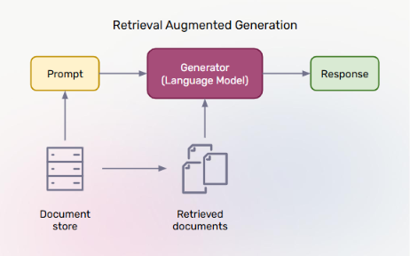
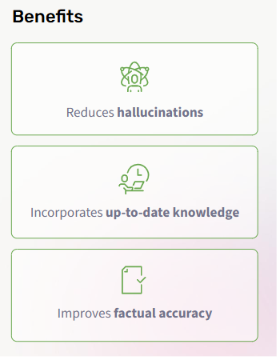
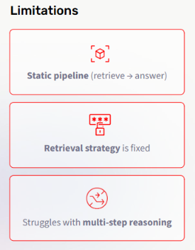
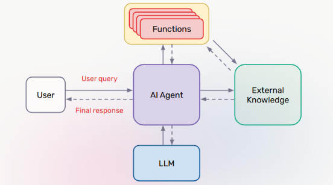
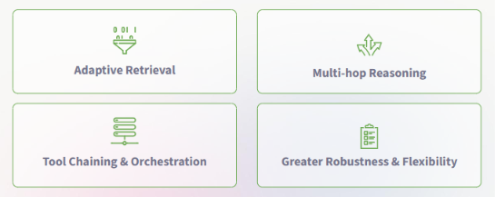
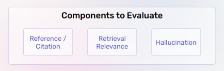
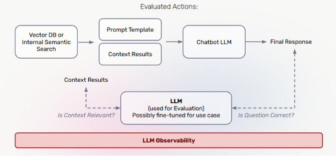

# Lecture 5: RAG + Agentic RAG

## Course: Agent Mastery

---

## 1. What Is RAG?

**RAG (Retrieval-Augmented Generation)** is a technique that grounds an LLM's response in external documents, rather than relying purely on what the model learned during training.

**How it works:**

1. A **Document store** holds your external knowledge (files, internal docs, knowledge bases).
2. Given a **Prompt** (user query), the system searches the document store and pulls out the most relevant **Retrieved documents**.
3. The **Generator (Language Model)** receives both the original prompt *and* the retrieved documents as context.
4. The model produces a **Response** grounded in that retrieved content, instead of relying solely on its internal/parametric knowledge.

**Key takeaway:** RAG separates *knowledge* from *reasoning* — the document store can be updated independently of the model, so the system always has access to current, relevant information without retraining.

---

## 2. Benefits of RAG

| Benefit | Why It Matters |
|---|---|
| **Reduces hallucinations** | Because the model is grounded in retrieved text, it's less likely to fabricate facts |
| **Incorporates up-to-date knowledge** | The document store can be refreshed continuously — no need to retrain the model to reflect new information |
| **Improves factual accuracy** | Responses can be traced back to real source documents, rather than relying on the model's memorized (and possibly outdated or wrong) knowledge |

---

## 3. Limitations of RAG

Despite its benefits, standard RAG has real structural weaknesses:

| Limitation | Explanation |
|---|---|
| **Static pipeline** (retrieve → answer) | The flow is fixed: retrieve once, then answer. There's no mechanism to retrieve *again* if the first retrieval wasn't good enough |
| **Retrieval strategy is fixed** | The same retrieval approach is applied to every query, regardless of whether that query actually needs a different strategy (e.g., broader search, multiple sources) |
| **Struggles with multi-step reasoning** | Complex questions that require combining information from multiple retrieval steps (e.g., "compare X and Y, then explain Z") are hard for a single retrieve-then-answer pass to handle |

This is exactly the gap that **Agentic RAG** is designed to close.

---

## 4. Agentic RAG — Solving RAG's Limitations

**Agentic RAG** wraps the retrieval process inside an *agent*, giving the system the ability to reason about **when**, **what**, and **how many times** to retrieve — instead of following one static pipeline.

**How it works:**

| Component | Role |
|---|---|
| **User** | Sends a **user query** and receives the **final response** |
| **AI Agent** | The central reasoning component — decides what actions to take, rather than following a fixed pipeline |
| **Functions** | Callable tools the agent can invoke as part of solving the query (connects back to Lecture 4: Tools) |
| **External Knowledge** | The retrieval source(s) — but now the agent decides *when* and *how* to query them, potentially multiple times |
| **LLM** | Powers the agent's reasoning and decision-making throughout the process |

**Key difference from standard RAG:** Instead of a single fixed "retrieve → answer" step, the agent can loop — retrieving, evaluating what it got, calling additional functions, and retrieving again — until it has enough information to respond correctly.

---

## 5. Benefits of Agentic RAG

By turning retrieval into an agent-driven process, Agentic RAG directly addresses each limitation from Section 3:

| Benefit | Addresses Which Limitation |
|---|---|
| **Adaptive Retrieval** | The agent adjusts its retrieval strategy per query, instead of using one fixed strategy for everything |
| **Multi-hop Reasoning** | The agent can retrieve, reason, and retrieve *again* — enabling multi-step questions that single-pass RAG can't handle |
| **Tool Chaining & Orchestration** | The agent can call multiple functions/tools in sequence, not just a single retrieval step (ties back to Lecture 4's tool categories) |
| **Greater Robustness & Flexibility** | Because the pipeline is no longer static, the system can adapt to a wider variety of query types and failure modes |

---

## 6. Types of Evals

Before diving into RAG-specific evaluation, it's worth understanding the two general *approaches* to evaluation you'll use throughout this course:

### LLM-as-a-Judge

- **What it is:** One model grades another model's output.
- **Strengths:** Scalable, nuanced, flexible — can judge subjective qualities like tone or clarity.
- **Limitations:** Can introduce bias or inconsistency if the judge prompt/setup is poorly designed.

### Code or Rule-Based Evals

- **What it is:** Deterministic checks — e.g., JSON validation, schema correctness.
- **Strengths:** Transparent, reproducible, objective.
- **Limitations:** Cannot capture subjective qualities like style or clarity — only checks what can be defined as a hard rule.

**Key takeaway:** Neither approach is sufficient alone. Most robust eval systems combine **rule-based checks** for objective correctness with **LLM-as-a-Judge** for nuanced, subjective quality — this combination shows up again in RAG evaluation below.

---

## 7. RAG Evaluations

Evaluating a RAG (or Agentic RAG) system means checking more than just the final answer — you need to evaluate the **retrieval process itself**.

**Core goals of RAG evaluation:**

- **Measure retrieval quality** — did the system retrieve documents that are actually relevant to the query?
- **Assess grounding effectiveness** — does the generated response actually rely on the retrieved content, rather than the model's own (possibly incorrect) internal knowledge?
- **Optimize system performance** — use eval results to tune retrieval strategy, chunking, or ranking over time

**Components to evaluate:**

| Component | What It Checks |
|---|---|
| **Reference / Citation** | Does the response correctly cite or reference the source documents it used? |
| **Retrieval Relevance** | Were the retrieved documents actually relevant to the query? |
| **Hallucination** | Did the response introduce claims not actually supported by the retrieved content? |

---

## 8. LLM Evaluation Framework

Putting it all together, here's how RAG evaluation fits into a full agent pipeline, with observability (Lecture 2) wrapped around the whole system:

**Reading the flow:**

1. A **Vector DB or Internal Semantic Search** retrieves **Context Results** based on the query.
2. These context results are combined with a **Prompt Template**.
3. The combined prompt is sent to the **Chatbot LLM**, which produces the **Final Response**.
4. In parallel, a separate **Evaluation LLM** (possibly fine-tuned for this specific use case) checks:
   - **"Is Context Relevant?"** — evaluating the retrieved **Context Results** (this is your Retrieval Relevance check from Section 7)
   - **"Is Question Correct?"** — evaluating the **Final Response** against the original question (this is your correctness/hallucination check)
5. The entire flow — retrieval, generation, and evaluation — is wrapped under **LLM Observability** (Lecture 2), meaning every one of these steps can be traced, measured, and debugged.

**Key takeaway:** This framework is essentially RAG evaluation (Section 7) applied as a *live, continuous check* rather than a one-time test — the evaluation LLM runs alongside the production chatbot, using the same tracing and observability principles from Lecture 2.

---

## 9. Test Your Understanding

Before moving to Lecture 6, check your understanding with these questions:

1. **In the standard RAG pipeline, what two inputs does the Generator (Language Model) receive before producing a response?**
2. **Why does RAG reduce hallucinations compared to relying on the model's parametric knowledge alone?**
3. **What specific limitation of standard RAG does "Multi-hop Reasoning" in Agentic RAG directly solve?**
4. **In the Agentic RAG diagram, what role do "Functions" play, and how does this connect to Lecture 4?**
5. **What is the key trade-off between LLM-as-a-Judge and Code/Rule-based evals?**
6. **In the LLM Evaluation Framework, what two questions does the Evaluation LLM ask, and which RAG eval component (from Section 7) does each map to?**

*(Try answering these from memory before checking back against Sections 1, 2, 3&5, 4, 6, and 8 respectively.)*

---

*Next: Lecture 6 — Evaluation*
