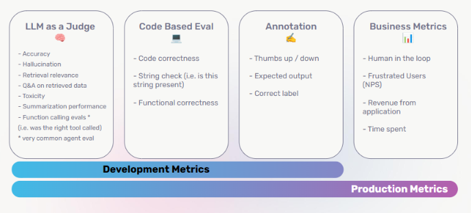
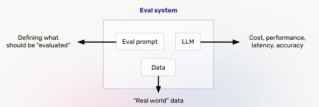

# Lecture 6: Agent Evaluation

## Course: Agent Mastery

---

## 1. Scope of Evaluation

Evaluation in the world of LLM-based systems happens at two distinct levels — it's important not to conflate them.

### LLM Model Evaluation

Measures the **general language understanding** of the foundational model itself — independent of any specific application built on top of it.

**Example benchmark datasets:**

| Benchmark | What It Tests |
|---|---|
| **MMLU** | Multiple-choice questions spanning math, philosophy, medicine, and more — general knowledge and reasoning |
| **HumanEval** | Code generation capability |

### LLM System Evaluation

Evaluates how well the **entire application** — including the LLM, its tools, retrieval, and orchestration — performs against **business requirements**.

- Testing datasets can be **manually created**, **synthesized**, or **curated from the application** (i.e., real-world usage data).

**Key takeaway:** Model evaluation tells you if the *foundation* is strong. System evaluation tells you if what you *built on top of it* actually works for your users. You need both — a great model can still power a poorly-designed agent system.

---

## 2. A Paradigm Shift from Traditional Software Testing

### Traditional Software Testing

- **Unit testing** — testing individual components of the software application in isolation
- **Integration testing** — testing how different components work together

### Testing in the Time of LLMs

- **Non-deterministic nature of LLMs** — outputs can vary even with the same input
- **Focus shifts** to testing the application's ability to respond to users' specific tasks, not just checking for an exact expected output
- **Output quality** must be examined along dimensions like **relevance** and **coherence**, rather than strict equality checks

---

## 3. Software Testing vs. Agent Evals

| | **Software Testing** | **Agent Evals** |
|---|---|---|
| **Determinism** | Software is deterministic | LLM agents are **non-deterministic** |
| **Unit-level behavior** | Unit tests are deterministic | Agents can take **multiple valid paths** to reach an outcome |
| **Foundation for testing** | Integration tests rely on the existing codebase and documentation | Improving agents relies on **data** — eval sets, traces, and real usage |

*(This reinforces the same comparison introduced in Lecture 1 — it's worth revisiting because it's the conceptual foundation for everything else in this lecture.)*

---

## 4. Common Types of Evaluations for LLM Systems

There are four common evaluation approaches, each suited to different needs — and each more relevant at different stages of your development lifecycle:

| Type | What It Checks | Examples |
|---|---|---|
| **LLM as a Judge** | Quality dimensions best assessed by another model | Accuracy, hallucination, retrieval relevance, Q&A on retrieved data, toxicity, summarization performance, **function calling evals*** |
| **Code Based Eval** | Deterministic, programmatic checks | Code correctness, string check (is this string present), functional correctness |
| **Annotation** | Human-in-the-loop judgment | Thumbs up/down, expected output comparison, correct label |
| **Business Metrics** | Real-world, production-level outcomes | Human in the loop, frustrated users (NPS), revenue from application, time spent |

**\*** Function calling evals (was the right tool called) are called out as a **very common agent eval** — directly connecting back to the tool-selection and function-calling evals from Lecture 1.

**Important pattern:** Notice the gradient across the bottom of the diagram — **LLM as a Judge** and **Code Based Eval** are typically used more heavily during **development**, while **Annotation** and **Business Metrics** become more central once a system is in **production**. This mirrors the natural lifecycle: you evaluate correctness before shipping, then evaluate real-world impact after.

---

## 5. What Is LLM-as-a-Judge?

Zooming into the "LLM as a Judge" approach: this is a dedicated **eval system**, structurally similar to the agent architectures we've already discussed.

**How it works:**

| Component | Role |
|---|---|
| **Eval prompt** | Defines *what* should be evaluated — the criteria the judge model will apply |
| **LLM** | The model acting as the judge, applying the eval prompt to the data |
| **Data** | Drawn from "real world" data — actual inputs/outputs from your application |
| **Output** | The eval system produces signals like cost, performance, latency, and accuracy |

**Key takeaway:** An eval system isn't just "ask an LLM if this is good" — it's a defined pipeline with its own prompt, model, and data inputs, producing measurable outputs you can track over time (tying back to observability from Lecture 2).

---

## 6. What Is an Eval Prompt?

An **eval prompt** is the specific prompt given to the judge LLM (from Section 5) that tells it exactly how to evaluate a piece of content. A well-constructed eval prompt follows a clear structure, with each part serving a distinct purpose:

| Structural Element | Purpose |
|---|---|
| **Set the role** | Establish what the judge LLM is being asked to do — e.g., *"You are examining written text content."* |
| **Provide the context** | Give the judge the actual data to evaluate, clearly delimited — e.g., wrapping the text between `[BEGIN DATA]` and `[END DATA]` markers so the model knows exactly what it's judging |
| **Provide the goal** | State precisely what the judge should determine — e.g., *"Examine the text and determine whether the text is toxic or not,"* along with a definition of what that judgment means (e.g., defining "toxicity" as hateful statements, demeaning language, inappropriate content, or threats) |
| **Define the terminology and the label** | Constrain the output format so it's usable programmatically — e.g., requiring the response to be a single word, either `"toxic"` or `"non-toxic"`, with no extra text or characters |

**Key takeaway:** A good eval prompt is engineered with the same rigor as a production prompt — it isn't just "grade this." It sets a clear role, bounds the input with explicit context, defines the goal and terminology unambiguously, and constrains the output to a format your system can reliably parse (this last point is what makes an LLM-as-a-Judge eval usable in an automated pipeline, connecting back to Code Based Evals from Section 4).

---

## 7. Designing Good Evaluations

Not all evaluations are equally useful — good evaluations follow a set of clear principles:

| Principle | What It Means |
|---|---|
| **Consistency** | Produces stable results over repeated runs |
| **Reproducibility** | Documented and version-controlled so others can replicate it |
| **Bias awareness** | Accounts for potential bias in the LLM evaluator itself |
| **Task alignment** | Measures what actually matters for the specific use case |
| **Actionability** | Provides feedback that guides improvement, not just an abstract score |

### Examples

- **Medical agent** → correctness matters more than style
- **Writing assistant** → fluency and tone matter more than rigid accuracy
- **Actionable eval example:** *"Hallucination detected at tool call"* is far more useful than a bare *"Overall score = 3.7"* — the first tells you exactly where and what to fix; the second doesn't.

> ⚠️ **Important:** There is no universal "correct" way to design an evaluation. **How you design your evals depends entirely on the nature of your agentic application or workflow, and the kind of output it produces.** A medical agent, a writing assistant, and a code-generation agent each need eval criteria tailored to *their* specific risks and quality bar — always design evaluations around what actually matters for your specific use case, not a generic template.

---

## 8. Putting It All Together

Evaluation doesn't exist in isolation — it works hand-in-hand with the observability concepts from Lecture 2:

- **Observability** explains the *process* by capturing traces and spans (Lecture 2, Section 5).
- **Evaluation** scores the *quality of outcomes* using structured methods (this lecture).
- Together, they form a **continuous feedback loop**:

  **Capture → Score → Improve → Repeat**

This cycle is the foundation of reliable, transparent, and trustworthy agent engineering — observability tells you *what happened*, and evaluation tells you *whether it was good*, and together they let you systematically improve your agent over time.

---

## 9. Test Your Understanding

Before moving to Lecture 7, check your understanding with these questions:

1. **What is the key difference between LLM Model Evaluation and LLM System Evaluation?**
2. **Why can't traditional unit/integration testing fully capture whether an LLM agent is working correctly?**
3. **Of the four common evaluation types, which two tend to dominate during development, and which two become more central in production?**
4. **What are the three main components of an eval system, and what does each contribute?**
5. **List the four structural elements of a well-designed eval prompt.**
6. **Why is "Hallucination detected at tool call" considered a more useful eval result than "Overall score = 3.7"?**
7. **True or false: a single evaluation framework/rubric should be reused across every type of agentic application. Explain your answer.**

*(Try answering these from memory before checking back against Sections 1, 2–3, 4, 5, 6, 7, and 7 respectively.)*

---

*Next: Lecture 7 — Post-Deployment + Production Monitoring*
