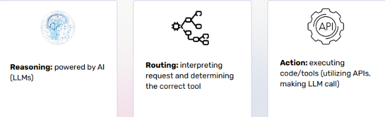
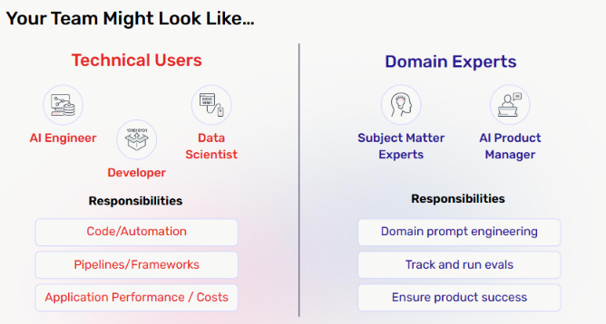
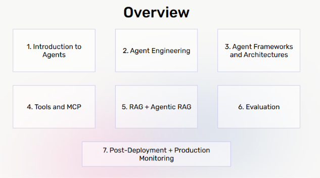

# Lecture 1: Overview

## Course: Agent Mastery

---

## 1. Who Is This Course For?

This course is designed for three overlapping audiences:

| Audience          | Goal                                                                                              |
| ----------------- | ------------------------------------------------------------------------------------------------- |
| **Beginners**     | Learn how to build agents from zero to one                                                        |
| **Practitioners** | Already building agents, but want to solidify core concepts — RAG, Tool Calling, MCP, Evals       |
| **Builders**      | Want a complete, end-to-end example they can deploy and continue learning from after the workshop |

If you fall into any of these categories, this material is built for you.

---

## 2. What Are Agents?

> **Definition:** Agents are software-based systems that can take actions on behalf of a user by utilizing reasoning.

Breaking this definition down, an agent is built on three core pillars:

| Pillar        | Description                                                                                                         |
| ------------- | ------------------------------------------------------------------------------------------------------------------- |
| **Reasoning** | Powered by an AI model (LLM). This is the "thinking" component — deciding _what_ to do.                             |
| **Routing**   | Interpreting the incoming request and determining the correct tool or path to fulfill it.                           |
| **Action**    | Executing code or tools — calling APIs, invoking the LLM, or running external functions to actually _do_ something. |

**In short:** an agent doesn't just respond with text — it reasons about a problem, decides how to solve it, and then takes real action (via tools, APIs, or code) to achieve a goal on the user's behalf.

---

## 3. Who Builds Agent Teams? (Team Composition)

Real-world agent teams typically split into two complementary groups:

### 🔧 Technical Users

**Roles:** AI Engineer · Developer · Data Scientist

**Responsibilities:**

- Code / Automation
- Pipelines / Frameworks
- Application performance & cost management

### 🧑‍💼 Domain Experts

**Roles:** Subject Matter Experts (SMEs) · AI Product Manager

**Responsibilities:**

- Domain-specific prompt engineering
- Tracking and running evaluations (evals)
- Ensuring the product actually succeeds for real users

**Key Takeaway:** Building good agents is _not_ a purely technical exercise. It requires collaboration between people who understand the systems (technical users) and people who understand the problem domain (domain experts).

---

## 4. Course Roadmap

The course is structured into 7 modules, moving from fundamentals to production:

1. **Introduction to Agents** — What agents are, core concepts (this lecture)
2. **Agent Engineering** — Practical design and construction of agents
3. **Agent Frameworks and Architectures** — Comparing tools and structural patterns
4. **Tools and MCP** — Giving agents the ability to act (Model Context Protocol)
5. **RAG + Agentic RAG** — Grounding agents in external knowledge
6. **Evaluation** — Measuring whether your agent actually works
7. **Post-Deployment + Production Monitoring** — Keeping agents reliable once they're live

---

## 5. Quick Recap

- An **agent** = Reasoning (LLM) + Routing (decision logic) + Action (tools/APIs).
- Agent projects need **both technical builders and domain experts** to succeed.
- The course moves from **foundations → engineering → frameworks → tools/MCP → RAG → evals → production**, giving a full lifecycle view of building and shipping agents.
